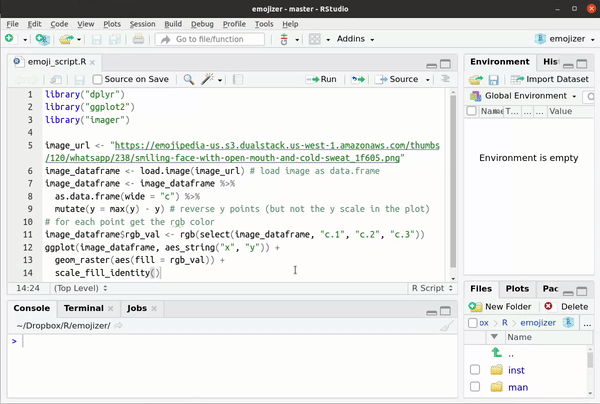

Automatically turn your R code into an emojized fully working R code.

## Installation

The `{emojizer}` package is currently only available as a GitHub package.
To install it, run the following from an R console:

```{r eval = FALSE}
if (!require("remotes")) {
  install.packages("remotes")
}
remotes::install_github("jcrodriguez1989/emojizer")
```

## Usage

Open an R file in your RStudio Source pane, find the "Emojize active file"
addin, and let it do its magic!

```{r, example_image, echo = FALSE}

```
